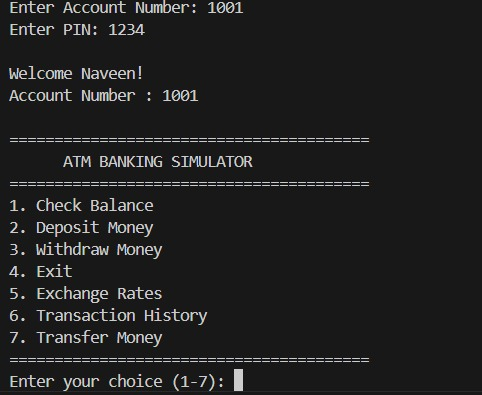
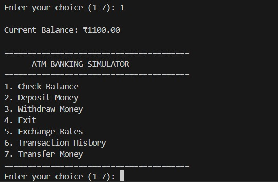
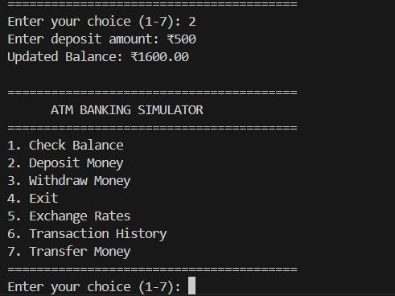
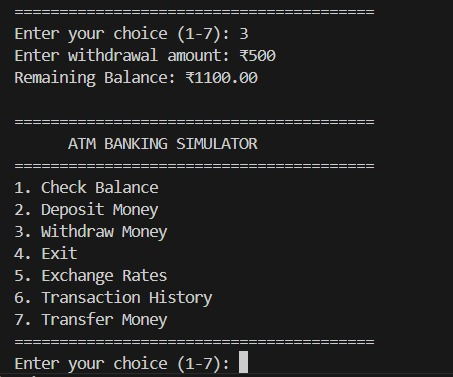
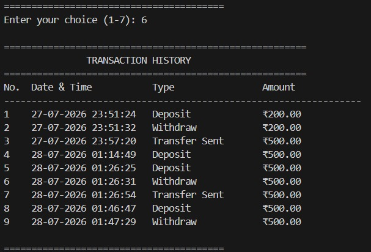
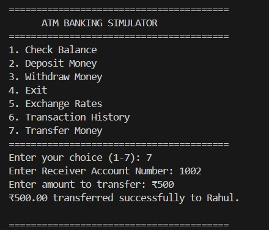
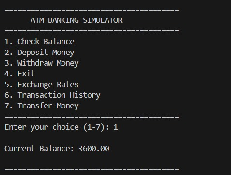

# ATM Banking Simulator

A menu-driven **Python console application** that simulates the core functionalities of an Automated Teller Machine (ATM). The application provides secure user authentication, account management, transaction processing, and live currency exchange rates while storing user information in a JSON-based database.

This project was developed to strengthen practical Python programming skills and demonstrate the implementation of real-world banking operations using a modular software design.

## Overview

The ATM Banking Simulator allows users to securely log in using an account number and PIN, perform common banking operations, and maintain transaction records. The project follows a modular architecture where each banking operation is implemented as an individual function, making the application easy to understand, maintain, and extend.

The application also integrates a public Exchange Rate API to display real-time currency exchange rates, demonstrating the use of REST APIs in Python.

## Features

- Secure account login using Account Number and PIN
- Balance enquiry
- Deposit money
- Withdraw money
- Money transfer between accounts
- Transaction history
- Live exchange rates using a REST API
- JSON-based persistent data storage
- Input validation and error handling
- Modular Python code structure
- Console-based user interface

## Project Screenshots

### Login and Main Menu



---

### Balance Enquiry



---

### Deposit Money



---

### Withdraw Money



---

### Live Exchange Rates


---

### Transaction History



---

### Money Transfer



---

### Updated Balance



---

# Project Structure

```text
ATM-Banking-Simulator/
│
├── data/
│   └── users.json
│
├── screenshots/
│   ├── Home_Page.jpeg
│   ├── Module1_Balance.jpg
│   ├── Module2_Deposit.jpg
│   ├── Module3_Withdraw.jpg
│   ├── Module4_Exchange_Rates.jpg
│   ├── Module5_Transaction_History.jpg
│   ├── Module6_Transfer_Money.jpg
│   └── Module7.jpg
│
├── atm.py
├── main.py
├── requirements.txt
├── README.md
└── .gitignore
```

# Technologies Used

- Python 3
- JSON
- Requests Library
- REST API
- Git
- GitHub

# Installation

## Clone the Repository

```bash
git clone https://github.com/VNKWORKS/ATM-Banking-Simulator.git
```

## Navigate to the Project

```bash
cd ATM-Banking-Simulator
```

## Install Dependencies

```bash
pip install -r requirements.txt
```

## Run the Application

```bash
python main.py
```

# Demo Accounts

| Name | Account Number | PIN |
|------|---------------:|----:|
| Naveen | 1001 | 1234 |
| Rahul | 1002 | 4321 |

# Application Workflow

```text
Start
   │
   ▼
Login using Account Number and PIN
   │
   ▼
Authentication Successful
   │
   ▼
Main Menu
   │
   ├── Check Balance
   ├── Deposit Money
   ├── Withdraw Money
   ├── Exchange Rates
   ├── Transaction History
   ├── Transfer Money
   └── Exit
```

# Banking Modules

## User Authentication

The application verifies the user's account number and PIN before granting access to banking operations. Invalid credentials immediately terminate the login process.

## Balance Enquiry

Displays the latest available balance from the user's account.

## Deposit Money

Allows users to deposit money into their account after validating the entered amount. Every successful deposit is automatically recorded in the transaction history.

## Withdraw Money

Allows users to withdraw money from their account after checking that:

- The amount is greater than zero.
- The account contains sufficient balance.

All successful withdrawals are stored in the transaction history.

## Money Transfer

Transfers funds securely between two registered accounts.

The application validates:

- Receiver account exists.
- Sender and receiver are different.
- Transfer amount is positive.
- Sender has sufficient balance.

Both sender and receiver transaction histories are updated automatically.

## Transaction History

Displays a complete list of previous banking operations including:

- Date and Time
- Transaction Type
- Transaction Amount

This provides a simple transaction log similar to a real banking system.

## Exchange Rates

The application retrieves live exchange rates using a public Exchange Rate API.

Supported currencies include:

- USD
- INR
- EUR
- GBP
- JPY

If the API is unavailable, the application handles the exception gracefully.

# Data Storage

User information is stored in a local JSON file.

Example:

```json
{
    "1001": {
        "name": "Naveen",
        "pin": "1234",
        "balance": 1100,
        "transactions": []
    }
}
```

Each account stores:

- Account holder name
- PIN
- Current balance
- Transaction history

# Skills Demonstrated

This project demonstrates practical experience with:

- Python Programming
- Modular Programming
- Function Design
- JSON File Handling
- Dictionary Operations
- List Operations
- REST API Integration
- Input Validation
- Exception Handling
- Console Application Development
- Version Control using Git
- GitHub Repository Management

# Key Learning Outcomes

Through this project, I gained practical experience in:

- Designing a modular software application
- Working with structured JSON data
- Implementing banking transactions
- Integrating external APIs
- Handling exceptions effectively
- Validating user input
- Maintaining persistent application data
- Managing projects using Git and GitHub

# Future Improvements

Potential enhancements include:

- SQLite or MySQL database support
- Password hashing and encryption
- User registration module
- Administrator dashboard
- Account statement generation
- Interest calculation
- PIN update functionality
- Unit testing
- Activity logging
- Graphical User Interface (GUI)
- Web application using Flask

# Repository

GitHub Repository

https://github.com/VNKWORKS/ATM-Banking-Simulator

# Author

**Naveen Kumar**

M.Tech in Information Technology

Python Developer | AI & Machine Learning Enthusiast

GitHub: https://github.com/VNKWORKS

LinkedIn: https://www.linkedin.com/in/naveen-kumar-g-v-000000123vnk

## Acknowledgements

This project was developed as a personal portfolio project to strengthen Python programming skills, understand modular software development, and demonstrate practical implementation of core banking operations in a console-based application.